<div align="center">
  <h1><code>[ João Bonfim ]</code></h1>
  <code>Backend Development · Artificial Inteligence · Electrical Engineering</code>
  
  <br>
</div>


<h2><code>&gt; /about</code></h2>

<table border="0" width="100%">
  <tr>
    <td width="45%">

```


$ whoami

Electrical Engineering student at the 
University of São Paulo (Poli-USP), 
interested in backend development and 
artificial inteligence. Also drawn to 
low-level programming — from C to 
hardware description languages like VHDL.


```
</td>
    <td width="55%" align="center">
      
    </td>
  </tr>
</table>

<br>

<h2><code>&gt; /tech_stack</code></h2>

<code>[ Languages & Frameworks ]</code>


<code>[ Data & Infrastructure ]</code>


<code>[ Tools ]</code> 


<br>


<h2><code>&gt; /featured_projects</code></h2>

| Project | Description |
|---|---|
| [mckinsey-hackathon](https://github.com/jpbonfim/mckinsey-hackathon) | Project for a hackathon hosted by McKinsey, aimed at engaging event attendees. |
| [fission-wizard](https://github.com/jpbonfim/fission-wizard) | Tool for automating mass deployment of Fission functions |
| [file-word-frequency-ai](https://github.com/jpbonfim/file-word-frequency-ai) | Word-frequency counter using NLP (spaCy) for text extraction and analysis |
| [PoliLEGv8-Processor](https://github.com/jpbonfim/PoliLEGv8-Processor) | VHDL implementation of a reduced 8-instruction LEGv8 processor, built for the Digital Systems II course at Poli-USP |
| [cave_and_tools](https://github.com/jpbonfim/cave_and_tools) | Procedural roguelike made in Unity. Features custom assets and procedural cave generation for a Computer Graphics final project. |
| [mini-smart-greenhouse](https://github.com/jpbonfim/mini-smart-greenhouse) | Automated greenhouse with temperature, lighting, and irrigation control via Arduino |


<br>

<h2><code>&gt; /stats</code></h2>
 
<div align="center">
  
  
</div>

<br/>

<div align="center">
  
</div>